# 12. 网络编程

## 12.1 网络概述

### 12.1.1 网络协议

从应用的角度出发，协议可理解为“规则”，是数据传输和数据的解释的规则。

假设，A、B 双方欲传输文件。规定：
 第一次，传输文件名，接收方接收到文件名，应答 OK 给传输方；
 第二次，发送文件的尺寸，接收方接收到该数据再次应答一个 OK；
 第三次，传输文件内容。同样，接收方接收数据完成后应答 OK 表示文件内容接收成功。

由此，无论 A、B 之间传递何种文件，都是通过三次数据传输来完成。A、B 之间形成了一个最简单的数据传输规则。双方都按此规则发送、接收数据。A、B 之间达成的这个相互遵守的规则即为协议。

这种仅在 A、B 之间被遵守的协议称之为原始协议。

当此协议被更多的人采用，不断的增加、改进、维护、完善。最终形成一个稳定的、完整的文件传输协议，被广泛应用于各种文件传输过程中。该协议就成为一个标准协议。最早的 ftp 协议就是由此衍生而来。

### 12.1.2 分层模型

#### 12.1.2.1 网络分层架构

为了减少协议设计的复杂性，大多数网络模型均采用分层的方式来组织。每一层都有自己的功能，就像建筑物一样，每一层都靠下一层支持。每一层利用下一层提供的服务来为上一层提供服务，本层服务的实现细节对上层屏蔽。

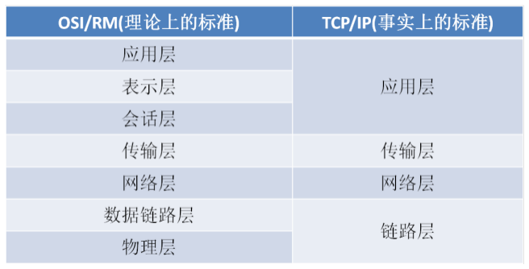

越下面的层，越靠近硬件；越上面的层，越靠近用户。至于每一层叫什么名字，其实并不重要（面试的时候，面试官可能会问每一层的名字）。只需要知道，互联网分成若干层即可。

1)物理层：主要定义物理设备标准，如网线的接口类型、光纤的接口类型、各种传输介质的传输速率等。它的主要作用是传输比特流（就是由 1、0 转化为电流强弱来进行传输，到达目的地后再转化为 1、0，也就是我们常说的数模转换与模数转换）。这一层的数据叫做比特。 2)数据链路层：定义了如何让格式化数据以帧为单位进行传输，以及如何让控制对物理介质的访问。这一层通常还提供错误检测和纠正，以确保数据的可靠传输。如：串口通信中使用到的 115200、8、N、1 3)网络层：在位于不同地理位置的网络中的两个主机系统之间提供连接和路径选择。Internet 的发展使得从世界各站点访问信息的用户数大大增加，而网络层正是管理这种连接的层。 4)传输层：定义了一些传输数据的协议和端口号（WWW 端口 80 等），如：TCP（传输控制协议，传输效率低，可靠性强，用于传输可靠性要求高，数据量大的数据），UDP（用户数据报协议，与 TCP 特性恰恰相反，用于传输可靠性要求不高，数据量小的数据，如 QQ 聊天数据就是通过这种方式传输的）。 主要是将从下层接收的数据进行分段和传输，到达目的地址后再进行重组。常常把这一层数据叫做段。 5)会话层：通过传输层(端口号：传输端口与接收端口)建立数据传输的通路。主要在你的系统之间发起会话或者接受会话请求（设备之间需要互相认识可以是 IP 也可以是 MAC 或者是主机名）。 6)表示层：可确保一个系统的应用层所发送的信息可以被另一个系统的应用层读取。例如，PC 程序与另一台计算机进行通信，其中一台计算机使用扩展二一十进制交换码(EBCDIC)，而另一台则使用美国信息交换标准码（ASCII）来表示相同的字符。如有必要，表示层会通过使用一种通格式来实现多种数据格式之间的转换。 7)应用层：是最靠近用户的 OSI 层。这一层为用户的应用程序（例如电子邮件、文件传输和终端仿真）提供网络服务。

#### 12.1.2.2 层与协议

每一层都是为了完成一种功能，为了实现这些功能，就需要大家都遵守共同的规则。大家都遵守这规则，就叫做“协议”（protocol）。

网络的每一层，都定义了很多协议。这些协议的总称，叫“TCP/IP 协议”。TCP/IP 协议是一个大家族，不仅仅只有 TCP 和 IP 协议，它还包括其它的协议，如下图：

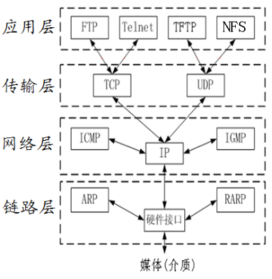

#### 12.1.2.3 每层协议的功能

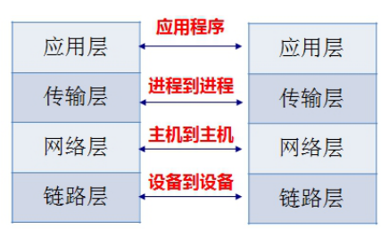

1. 链路层
   以太网规定，连入网络的所有设备，都必须具有“网卡”接口。数据包必须是从一块网卡，传送到另一块网卡。通过网卡能够使不同的计算机之间连接，从而完成数据通信等功能。网卡的地址——MAC 地址，就是数据包的物理发送地址和物理接收地址。

2. 网络层
   网络层的作用是引进一套新的地址，使得我们能够区分不同的计算机是否属于同一个子网络。这套地址就叫做“网络地址”，这是我们平时所说的 IP 地址。这个 IP 地址好比我们的手机号码，通过手机号码可以得到用户所在的归属地。

网络地址帮助我们确定计算机所在的子网络，MAC 地址则将数据包送到该子网络中的目标网卡。网络层协议包含的主要信息是源 IP 和目的 IP。

于是，“网络层”出现以后，每台计算机有了两种地址，一种是 MAC 地址，另一种是网络地址。两种地址之间没有任何联系，MAC 地址是绑定在网卡上的，网络地址则是管理员分配的，它们只是随机组合在一起。

网络地址帮助我们确定计算机所在的子网络，MAC 地址则将数据包送到该子网络中的目标网卡。因此，从逻辑上可以推断，必定是先处理网络地址，然后再处理 MAC 地址。

3. 传输层
   当我们一边聊 QQ，一边聊微信，当一个数据包从互联网上发来的时候，我们怎么知道，它是来自 QQ 的内容，还是来自微信的内容？

也就是说，我们还需要一个参数，表示这个数据包到底供哪个程序（进程）使用。这个参数就叫做“端口”（port），它其实是每一个使用网卡的程序的编号。每个数据包都发到主机的特定端口，所以不同的程序就能取到自己所需要的数据。

端口特点：
 对于同一个端口，在不同系统中对应着不同的进程
 对于同一个系统，一个端口只能被一个进程拥有

4. 应用层
   应用程序收到“传输层”的数据，接下来就要进行解读。由于互联网是开放架构，数据来源五花八门，必须事先规定好格式，否则根本无法解读。“应用层”的作用，就是规定应用程序的数据格式。

## 12.2 Socket 编程

### 12.2.1 什么是 Socket

Socket 起源于 Unix，而 Unix 基本哲学之一就是“一切皆文件”，都可以用“打开 open –> 读写 write/read –> 关闭 close”模式来操作。Socket 就是该模式的一个实现，网络的 Socket 数据传输是一种特殊的 I/O，Socket 也是一种文件描述符。Socket 也具有一个类似于打开文件的函数调用：Socket()，该函数返回一个整型的 Socket 描述符，随后的连接建立、数据传输等操作都是通过该 Socket 实现的。

常用的 Socket 类型有两种：流式 Socket（SOCK_STREAM）和数据报式 Socket（SOCK_DGRAM）。流式是一种面向连接的 Socket，针对于面向连接的 TCP 服务应用；数据报式 Socket 是一种无连接的 Socket，对应于无连接的 UDP 服务应用。

### 12.2.2 TCP 的 C/S 架构

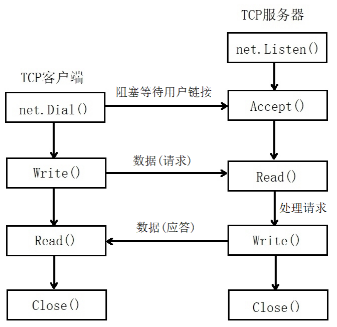

### 12.2.3 示例程序

#### 12.2.3.1 服务器代码

```Go
package main

import (
    "fmt"
    "log"
    "net"
    "strings"
)

func dealConn(conn net.Conn) {

    defer conn.Close() //此函数结束时，关闭连接套接字

    //conn.RemoteAddr().String()：连接客服端的网络地址
    ipAddr := conn.RemoteAddr().String()
    fmt.Println(ipAddr, "连接成功")

    buf := make([]byte, 1024) //缓冲区，用于接收客户端发送的数据

    for {
        //阻塞等待用户发送的数据
        n, err := conn.Read(buf) //n代码接收数据的长度
        if err != nil {
            fmt.Println(err)
            return
        }
        //切片截取，只截取有效数据
        result := buf[:n]
        fmt.Printf("接收到数据来自[%s]==>[%d]:%s\n", ipAddr, n, string(result))
        if "exit" == string(result) { //如果对方发送"exit"，退出此链接
            fmt.Println(ipAddr, "退出连接")
            return
        }

        //把接收到的数据转换为大写，再给客户端发送
        conn.Write([]byte(strings.ToUpper(string(result))))
    }
}

func main() {
    //创建、监听socket
    listenner, err := net.Listen("tcp", "127.0.0.1:8000")
    if err != nil {
        log.Fatal(err) //log.Fatal()会产生panic
    }

    defer listenner.Close()

    for {
        conn, err := listenner.Accept() //阻塞等待客户端连接
        if err != nil {
            log.Println(err)
            continue
        }

        go dealConn(conn)
    }
}
```

#### 12.2.3.2 客服端代码

```Go
package main

import (
    "fmt"
    "log"
    "net"
)

func main() {
    //客户端主动连接服务器
    conn, err := net.Dial("tcp", "127.0.0.1:8000")
    if err != nil {
        log.Fatal(err) //log.Fatal()会产生panic
        return
    }

    defer conn.Close() //关闭

    buf := make([]byte, 1024) //缓冲区
    for {
        fmt.Printf("请输入发送的内容：")
        fmt.Scan(&buf)
        fmt.Printf("发送的内容：%s\n", string(buf))

        //发送数据
        conn.Write(buf)

        //阻塞等待服务器回复的数据
        n, err := conn.Read(buf) //n代码接收数据的长度
        if err != nil {
            fmt.Println(err)
            return
        }

        //切片截取，只截取有效数据
        result := buf[:n]
        fmt.Printf("接收到数据[%d]:%s\n", n, string(result))
    }
}
```

#### 12.2.3.3 运行结果

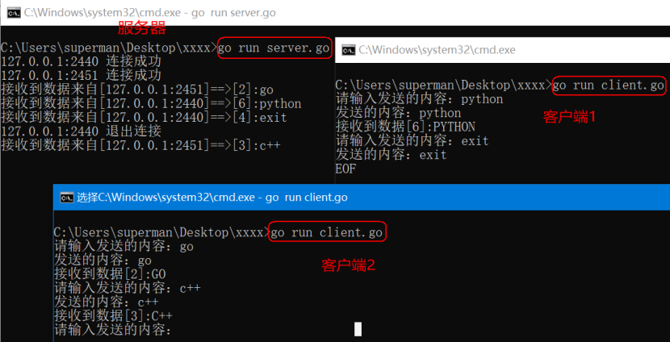

## 12.3 HTTP 编程

### 12.3.1 概述

#### 12.3.1.1 Web 工作方式

我们平时浏览网页的时候,会打开浏览器，输入网址后按下回车键，然后就会显示出你想要浏览的内容。在这个看似简单的用户行为背后，到底隐藏了些什么呢？

对于普通的上网过程，系统其实是这样做的：浏览器本身是一个客户端，当你输入 URL 的时候，首先浏览器会去请求 DNS 服务器，通过 DNS 获取相应的域名对应的 IP，然后通过 IP 地址找到 IP 对应的服务器后，要求建立 TCP 连接，等浏览器发送完 HTTP Request（请求）包后，服务器接收到请求包之后才开始处理请求包，服务器调用自身服务，返回 HTTP Response（响应）包；客户端收到来自服务器的响应后开始渲染这个 Response 包里的主体（body），等收到全部的内容随后断开与该服务器之间的 TCP 连接。

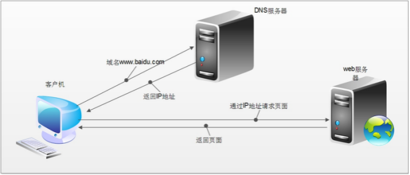

一个 Web 服务器也被称为 HTTP 服务器，它通过 HTTP 协议与客户端通信。这个客户端通常指的是 Web 浏览器(其实手机端客户端内部也是浏览器实现的)。

Web 服务器的工作原理可以简单地归纳为：
 客户机通过 TCP/IP 协议建立到服务器的 TCP 连接
 客户端向服务器发送 HTTP 协议请求包，请求服务器里的资源文档
 服务器向客户机发送 HTTP 协议应答包，如果请求的资源包含有动态语言的内容，那么服务器会调用动态语言的解释引擎负责处理“动态内容”，并将处理得到的数据返回给客户端
 客户机与服务器断开。由客户端解释 HTML 文档，在客户端屏幕上渲染图形结果

#### 12.3.1.2 HTTP 协议

超文本传输协议(HTTP，HyperText Transfer Protocol)是互联网上应用最为广泛的一种网络协议，它详细规定了浏览器和万维网服务器之间互相通信的规则，通过因特网传送万维网文档的数据传送协议。

HTTP 协议通常承载于 TCP 协议之上，有时也承载于 TLS 或 SSL 协议层之上，这个时候，就成了我们常说的 HTTPS。如下图所示：

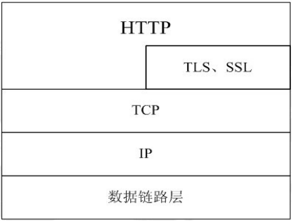

#### 12.3.1.3 地址（URL）

URL 全称为 Unique Resource Location，用来表示网络资源，可以理解为网络文件路径。

URL 的格式如下：
http://host[":"port][abs_path]
http://192.168.31.1/html/index

URL 的长度有限制，不同的服务器的限制值不太相同，但是不能无限长。

### 12.3.2 HTTP 报文浅析

#### 12.3.2.1 请求报文格式

1. 测试代码
   服务器测试代码：

```Go
package main

import (
    "fmt"
    "log"
    "net"
)

func main() {
    //创建、监听socket
    listenner, err := net.Listen("tcp", "127.0.0.1:8000")
    if err != nil {
        log.Fatal(err) //log.Fatal()会产生panic
    }

    defer listenner.Close()

    conn, err := listenner.Accept() //阻塞等待客户端连接
    if err != nil {
        log.Println(err)
        return
    }

    defer conn.Close() //此函数结束时，关闭连接套接字

    //conn.RemoteAddr().String()：连接客服端的网络地址
    ipAddr := conn.RemoteAddr().String()
    fmt.Println(ipAddr, "连接成功")

    buf := make([]byte, 4096) //缓冲区，用于接收客户端发送的数据

    //阻塞等待用户发送的数据
    n, err := conn.Read(buf) //n代码接收数据的长度
    if err != nil {
        fmt.Println(err)
        return
    }

    //切片截取，只截取有效数据
    result := buf[:n]
    fmt.Printf("接收到数据来自[%s]==>:\n%s\n", ipAddr, string(result))
}
```

浏览器输入 url 地址：


服务器端运行打印结果如下：

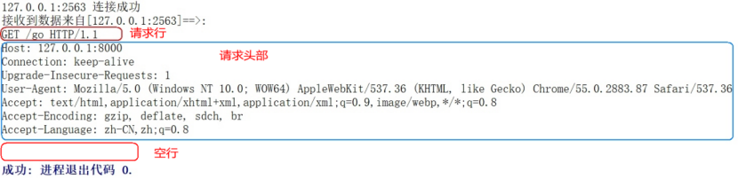

2. 请求报文格式说明
   HTTP 请求报文由请求行、请求头部、空行、请求包体 4 个部分组成，如下图所示：

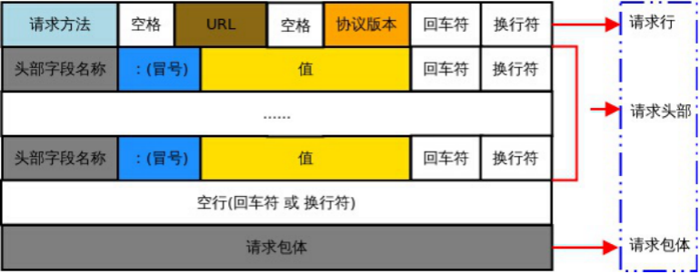

1)请求行
请求行由方法字段、URL 字段 和 HTTP 协议版本字段 3 个部分组成，他们之间使用空格隔开。常用的 HTTP 请求方法有 GET、POST。

GET：
 当客户端要从服务器中读取某个资源时，使用 GET 方法。GET 方法要求服务器将 URL 定位的资源放在响应报文的数据部分，回送给客户端，即向服务器请求某个资源。
 使用 GET 方法时，请求参数和对应的值附加在 URL 后面，利用一个问号(“?”)代表 URL 的结尾与请求参数的开始，传递参数长度受限制，因此 GET 方法不适合用于上传数据。
 通过 GET 方法来获取网页时，参数会显示在浏览器地址栏上，因此保密性很差。

POST：
 当客户端给服务器提供信息较多时可以使用 POST 方法，POST 方法向服务器提交数据，比如完成表单数据的提交，将数据提交给服务器处理。
GET 一般用于获取/查询资源信息，POST 会附带用户数据，一般用于更新资源信息。POST 方法将请求参数封装在 HTTP 请求数据中，而且长度没有限制，因为 POST 携带的数据，在 HTTP 的请求正文中，以名称/值的形式出现，可以传输大量数据。

2)请求头部
请求头部为请求报文添加了一些附加信息，由“名/值”对组成，每行一对，名和值之间使用冒号分隔。
请求头部通知服务器有关于客户端请求的信息，典型的请求头有：
请求头 含义
User-Agent 请求的浏览器类型
Accept 客户端可识别的响应内容类型列表，星号“ _ ”用于按范围将类型分组，用“ _/_ ”指示可接受全部类型，用“ type/_ ”指示可接受 type 类型的所有子类型
Accept-Language 客户端可接受的自然语言
Accept-Encoding 客户端可接受的编码压缩格式
Accept-Charset 可接受的应答的字符集
Host 请求的主机名，允许多个域名同处一个 IP 地址，即虚拟主机
connection 连接方式(close 或 keepalive)
Cookie 存储于客户端扩展字段，向同一域名的服务端发送属于该域的 cookie

3)空行
最后一个请求头之后是一个空行，发送回车符和换行符，通知服务器以下不再有请求头。

4)请求包体
请求包体不在 GET 方法中使用，而是 POST 方法中使用。
POST 方法适用于需要客户填写表单的场合。与请求包体相关的最常使用的是包体类型 Content-Type 和包体长度 Content-Length。

#### 12.3.2.2 响应报文格式

1. 测试代码
   服务器示例代码：

```Go
package main

import (
    "fmt"
    "net/http"
)

//服务端编写的业务逻辑处理程序
func myHandler(w http.ResponseWriter, r *http.Request) {
    fmt.Fprintln(w, "hello world")
}

func main() {
    http.HandleFunc("/go", myHandler)

    //在指定的地址进行监听，开启一个HTTP
    http.ListenAndServe("127.0.0.1:8000", nil)
}
```

启动服务器程序：

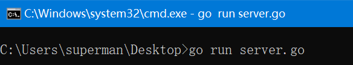

客户端测试示例代码：

```Go
package main

import (
    "fmt"
    "log"
    "net"
)

func main() {
    //客户端主动连接服务器
    conn, err := net.Dial("tcp", "127.0.0.1:8000")
    if err != nil {
        log.Fatal(err) //log.Fatal()会产生panic
        return
    }

    defer conn.Close() //关闭

    requestHeader := "GET /go HTTP/1.1\r\nAccept: image/gif, image/jpeg, image/pjpeg, application/x-ms-application, application/xaml+xml, application/x-ms-xbap, */*\r\nAccept-Language: zh-Hans-CN,zh-Hans;q=0.8,en-US;q=0.5,en;q=0.3\r\nUser-Agent: Mozilla/4.0 (compatible; MSIE 7.0; Windows NT 10.0; WOW64; Trident/7.0; .NET4.0C; .NET4.0E; .NET CLR 2.0.50727; .NET CLR 3.0.30729; .NET CLR 3.5.30729)\r\nAccept-Encoding: gzip, deflate\r\nHost: 127.0.0.1:8000\r\nConnection: Keep-Alive\r\n\r\n"

    //先发送请求包
    conn.Write([]byte(requestHeader))

    buf := make([]byte, 4096) //缓冲区

    //阻塞等待服务器回复的数据
    n, err := conn.Read(buf) //n代码接收数据的长度
    if err != nil {
        fmt.Println(err)
        return
    }
    //切片截取，只截取有效数据
    result := buf[:n]
    fmt.Printf("接收到数据[%d]:\n%s\n", n, string(result))
}
```

启动程序，测试 http 的成功响应报文：

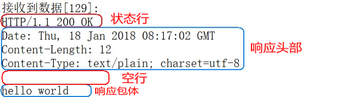

启动程序，测试 http 的失败响应报文：


2. 响应报文格式说明
   HTTP 响应报文由状态行、响应头部、空行、响应包体 4 个部分组成，如下图所示：

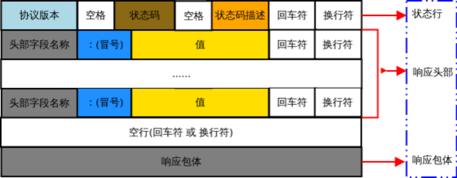

1)状态行
状态行由 HTTP 协议版本字段、状态码和状态码的描述文本 3 个部分组成，他们之间使用空格隔开。

状态码：
状态码由三位数字组成，第一位数字表示响应的类型，常用的状态码有五大类如下所示：
状态码 含义
1xx 表示服务器已接收了客户端请求，客户端可继续发送请求
2xx 表示服务器已成功接收到请求并进行处理
3xx 表示服务器要求客户端重定向
4xx 表示客户端的请求有非法内容
5xx 表示服务器未能正常处理客户端的请求而出现意外错误

常见的状态码举例：
状态码 含义
200 OK 客户端请求成功
400 Bad Request 请求报文有语法错误
401 Unauthorized 未授权
403 Forbidden 服务器拒绝服务
404 Not Found 请求的资源不存在
500 Internal Server Error 服务器内部错误
503 Server Unavailable 服务器临时不能处理客户端请求(稍后可能可以)

2)响应头部
响应头可能包括：
响应头 含义
Location Location 响应报头域用于重定向接受者到一个新的位置
Server Server 响应报头域包含了服务器用来处理请求的软件信息及其版本
Vary 指示不可缓存的请求头列表
Connection 连接方式

3)空行
最后一个响应头部之后是一个空行，发送回车符和换行符，通知服务器以下不再有响应头部。

4)响应包体
服务器返回给客户端的文本信息。

### 12.3.3 HTTP 编程

Go 语言标准库内建提供了 net/http 包，涵盖了 HTTP 客户端和服务端的具体实现。使用
net/http 包，我们可以很方便地编写 HTTP 客户端或服务端的程序。

#### 12.3.3.1 HTTP 服务端

示例代码：

```Go
package main

import (
    "fmt"
    "net/http"
)

//服务端编写的业务逻辑处理程序
//hander函数： 具有func(w http.ResponseWriter, r *http.Requests)签名的函数
func myHandler(w http.ResponseWriter, r *http.Request) {
    fmt.Println(r.RemoteAddr, "连接成功")  //r.RemoteAddr远程网络地址
    fmt.Println("method = ", r.Method) //请求方法
    fmt.Println("url = ", r.URL.Path)
    fmt.Println("header = ", r.Header)
    fmt.Println("body = ", r.Body)

    w.Write([]byte("hello go")) //给客户端回复数据
}

func main() {
    http.HandleFunc("/go", myHandler)

    //该方法用于在指定的 TCP 网络地址 addr 进行监听，然后调用服务端处理程序来处理传入的连接请求。
    //该方法有两个参数：第一个参数 addr 即监听地址；第二个参数表示服务端处理程序，通常为空
    //第二个参数为空意味着服务端调用 http.DefaultServeMux 进行处理
    http.ListenAndServe("127.0.0.1:8000", nil)
}
```

浏览器输入 url 地址：


服务器运行结果：

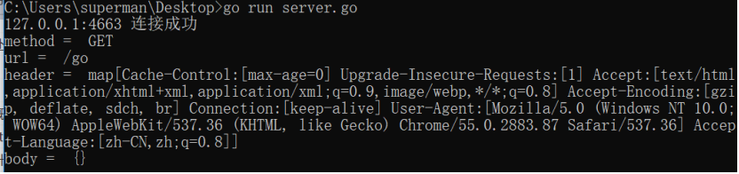

#### 12.3.3.2 HTTP 客户端

```Go
package main

import (
    "fmt"
    "io"
    "log"
    "net/http"
)

func main() {

    //get方式请求一个资源
    //resp, err := http.Get("http://www.baidu.com")
    //resp, err := http.Get("http://www.neihan8.com/article/index.html")
    resp, err := http.Get("http://127.0.0.1:8000/go")
    if err != nil {
        log.Println(err)
        return
    }

    defer resp.Body.Close() //关闭

    fmt.Println("header = ", resp.Header)
    fmt.Printf("resp status %s\nstatusCode %d\n", resp.Status, resp.StatusCode)
    fmt.Printf("body type = %T\n", resp.Body)

    buf := make([]byte, 2048) //切片缓冲区
    var tmp string

    for {
        n, err := resp.Body.Read(buf) //读取body包内容
        if err != nil && err != io.EOF {
            fmt.Println(err)
            return
        }

        if n == 0 {
            fmt.Println("读取内容结束")
            break
        }
        tmp += string(buf[:n]) //累加读取的内容
    }

    fmt.Println("buf = ", string(tmp))
}
```
