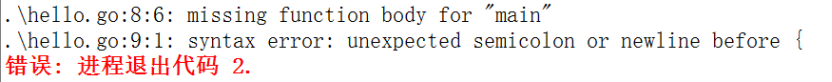
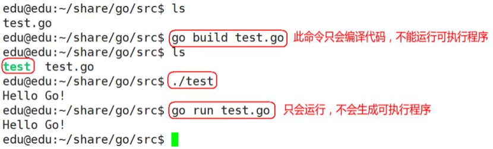

# 1. 初识 Go 语言

## 1.1 Go 语言介绍

### 1.1.1 Go 语言是什么

2009 年 11 月 10 日，Go 语言正式成为开源编程语言家庭的一员。

Go 语言（或称 Golang）是云计算时代的 C 语言。Go 语言的诞生是为了让程序员有更高的生产效率，Go 语言专门针对多处理器系统应用程序的编程进行了优化，使用 Go 编译的程序可以媲美 C 或 C++代码的速度，而且更加安全、支持并行进程。

开发人员在为项目选择语言时，不得不在快速开发和性能之间做出选择。C 和 C++这类语言提供了很快的执行速度，而 Ruby 和 Python 这类语言则擅长快速开发。Go 语言在这两者间架起了桥梁，不仅提供了高性能的语言，同时也让开发更快速。

### 1.1.2 Go 语言优势

 可直接编译成机器码，不依赖其他库，glibc 的版本有一定要求，部署就是扔一个文件上去就完成了。
 静态类型语言，但是有动态语言的感觉，静态类型的语言就是可以在编译的时候检查出来隐藏的大多数问题，动态语言的感觉就是有很多的包可以使用，写起来的效率很高。
 语言层面支持并发，这个就是 Go 最大的特色，天生的支持并发。Go 就是基因里面支持的并发，可以充分的利用多核，很容易的使用并发。
 内置 runtime，支持垃圾回收，这属于动态语言的特性之一吧，虽然目前来说 GC(内存垃圾回收机制)不算完美，但是足以应付我们所能遇到的大多数情况，特别是 Go1.1 之后的 GC。
 简单易学，Go 语言的作者都有 C 的基因，那么 Go 自然而然就有了 C 的基因，那么 Go 关键字是 25 个，但是表达能力很强大，几乎支持大多数你在其他语言见过的特性：继承、重载、对象等。
 丰富的标准库，Go 目前已经内置了大量的库，特别是网络库非常强大。
 内置强大的工具，Go 语言里面内置了很多工具链，最好的应该是 gofmt 工具，自动化格式化代码，能够让团队 review 变得如此的简单，代码格式一模一样，想不一样都很困难。
 跨平台编译，如果你写的 Go 代码不包含 cgo，那么就可以做到 window 系统编译 linux 的应用，如何做到的呢？Go 引用了 plan9 的代码，这就是不依赖系统的信息。
 内嵌 C 支持，Go 里面也可以直接包含 C 代码，利用现有的丰富的 C 库。

### 1.1.3 Go 适合用来做什么

 服务器编程，以前你如果使用 C 或者 C++做的那些事情，用 Go 来做很合适，例如处理日志、数据打包、虚拟机处理、文件系统等。
 分布式系统，数据库代理器等。
 网络编程，这一块目前应用最广，包括 Web 应用、API 应用、下载应用。
 内存数据库，如 google 开发的 groupcache，couchbase 的部分组建。
 云平台，目前国外很多云平台在采用 Go 开发，CloudFoundy 的部分组建，前 VMare 的技术总监自己出来搞的 apcera 云平台。

## 1.2 环境搭建

### 1.2.1 安装和设置

请参考资料：Go 语言环境搭建

### 1.2.2 标准命令概述

Go 语言中包含了大量用于处理 Go 语言代码的命令和工具。其中，go 命令就是最常用的一个，它有许多子命令。这些子命令都拥有不同的功能，如下所示。
build：用于编译给定的代码包或 Go 语言源码文件及其依赖包。
clean：用于清除执行其他 go 命令后遗留的目录和文件。
doc：用于执行 godoc 命令以打印指定代码包。
env：用于打印 Go 语言环境信息。
fix：用于执行 go tool fix 命令以修正给定代码包的源码文件中包含的过时语法和代码调用。
fmt：用于执行 gofmt 命令以格式化给定代码包中的源码文件。
get：用于下载和安装给定代码包及其依赖包(提前安装 git 或 hg)。
list：用于显示给定代码包的信息。
run：用于编译并运行给定的命令源码文件。
install：编译包文件并编译整个程序。
test：用于测试给定的代码包。
tool：用于运行 Go 语言的特殊工具。
version：用于显示当前安装的 Go 语言的版本信息。

### 1.2.3 学习资料

Go 语言官网(需要翻墙)：https://golang.org/
go 中文社区：https://studygolang.com
go 中文在线文档：https://studygolang.com/pkgdoc

## 1.3 第一个 Go 程序

### 1.3.1 Hello Go

```Go
  // hello.go
  package main

  import (
      "fmt"
  )

  func main() {
      fmt.Println("Hello Go!")
  }
```

### 1.3.2 代码分析

每个 Go 源代码文件的开头都是一个 package 声明，表示该 Go 代码所属的包。包是 Go 语言里最基本的分发单位，也是工程管理中依赖关系的体现。

要生成 Go 可执行程序，必须建立一个名字为 main 的包，并且在该包中包含一个叫 main()的函数（该函数是 Go 可执行程序的执行起点）。

Go 语言的 main()函数不能带参数，也不能定义返回值。

在包声明之后，是一系列的 import 语句，用于导入该程序所依赖的包。由于本示例程序用到了 Println()函数，所以需要导入该函数所属的 fmt 包。

所有 Go 函数以关键字 func 开头。一个常规的函数定义包含以下部分：
func 函数名(参数列表)(返回值列表) {
    // 函数体
}

Go 程序的代码注释与 C++保持一致，即同时支持以下两种用法：
/_ 块注释 _/

// 行注释

Go 程序并不要求开发者在每个语句后面加上分号表示语句结束，这是与 C 和 C++的一个明显不同之处。

注意：强制左花括号{的放置位置，如果把左花括号{另起一行放置，这样做的结果是 Go 编译器报告编译错误。



### 1.3.3 命令行运行程序


