# 11. 并发编程

## 11.1 概述

### 11.1.1 并行和并发

并行(parallel)：指在同一时刻，有多条指令在多个处理器上同时执行。

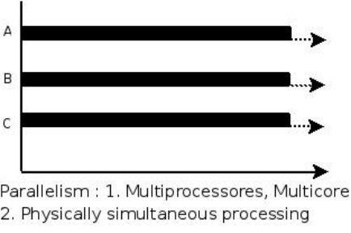

并发(concurrency)：指在同一时刻只能有一条指令执行，但多个进程指令被快速的轮换执行，使得在宏观上具有多个进程同时执行的效果，但在微观上并不是同时执行的，只是把时间分成若干段，使多个进程快速交替的执行。

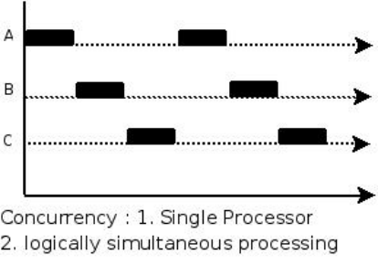

 并行是两个队列同时使用两台咖啡机
 并发是两个队列交替使用一台咖啡机

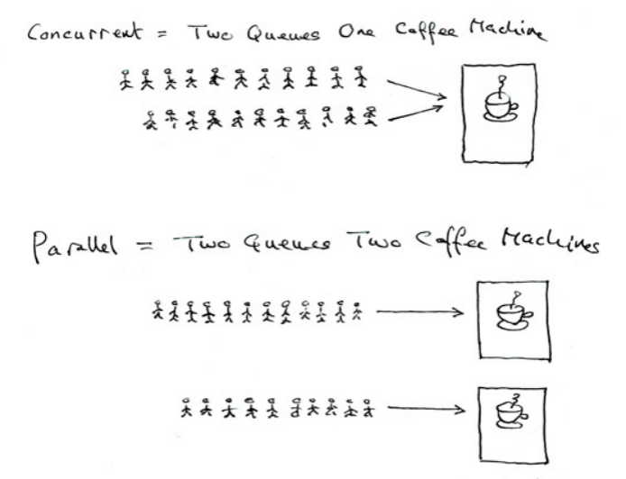

### 11.1.2 Go 语言并发优势

有人把 Go 比作 21 世纪的 C 语言，第一是因为 Go 语言设计简单，第二，21 世纪最重要的就是并行程序设计，而 Go 从语言层面就支持了并行。同时，并发程序的内存管理有时候是非常复杂的，而 Go 语言提供了自动垃圾回收机制。

Go 语言为并发编程而内置的上层 API 基于 CSP(communicating sequential processes, 顺序通信进程)模型。这就意味着显式锁都是可以避免的，因为 Go 语言通过相册安全的通道发送和接受数据以实现同步，这大大地简化了并发程序的编写。

一般情况下，一个普通的桌面计算机跑十几二十个线程就有点负载过大了，但是同样这台机器却可以轻松地让成百上千甚至过万个 goroutine 进行资源竞争。

## 11.2 goroutine

### 11.2.1 goroutine 是什么

goroutine 是 Go 并行设计的核心。goroutine 说到底其实就是协程，但是它比线程更小，十几个 goroutine 可能体现在底层就是五六个线程，Go 语言内部帮你实现了这些 goroutine 之间的内存共享。执行 goroutine 只需极少的栈内存(大概是 4~5KB)，当然会根据相应的数据伸缩。也正因为如此，可同时运行成千上万个并发任务。goroutine 比 thread 更易用、更高效、更轻便。

### 11.2.2 创建 goroutine

只需在函数调⽤语句前添加 go 关键字，就可创建并发执⾏单元。开发⼈员无需了解任何执⾏细节，调度器会自动将其安排到合适的系统线程上执行。

在并发编程里，我们通常想讲一个过程切分成几块，然后让每个 goroutine 各自负责一块工作。当一个程序启动时，其主函数即在一个单独的 goroutine 中运行，我们叫它 main goroutine。新的 goroutine 会用 go 语句来创建。

示例代码：

```Go
package main

import (
    "fmt"
    "time"
)

func newTask() {
    i := 0
    for {
        i++
        fmt.Printf("new goroutine: i = %d\n", i)
        time.Sleep(1 * time.Second) //延时1s
    }
}

func main() {
    //创建一个 goroutine，启动另外一个任务
    go newTask()

    i := 0
    //main goroutine 循环打印
    for {
        i++
        fmt.Printf("main goroutine: i = %d\n", i)
        time.Sleep(1 * time.Second) //延时1s
    }
}
```

程序运行结果：

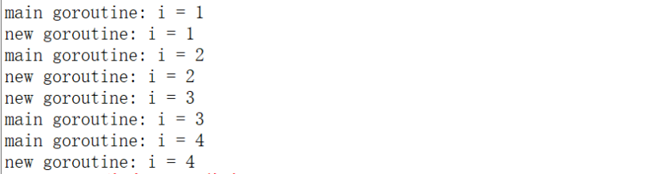

### 11.2.3 主 goroutine 先退出

主 goroutine 退出后，其它的工作 goroutine 也会自动退出：

```Go
func newTask() {
    i := 0
    for {
        i++
        fmt.Printf("new goroutine: i = %d\n", i)
        time.Sleep(1 * time.Second) //延时1s
    }
}

func main() {
    //创建一个 goroutine，启动另外一个任务
    go newTask()

    fmt.Println("main goroutine exit")
}
```

程序运行结果：

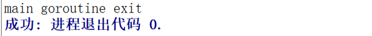

### 11.2.4 runtime 包

#### 11.2.4.1 Gosched

runtime.Gosched() 用于让出 CPU 时间片，让出当前 goroutine 的执行权限，调度器安排其他等待的任务运行，并在下次某个时候从该位置恢复执行。

这就像跑接力赛，A 跑了一会碰到代码 runtime.Gosched() 就把接力棒交给 B 了，A 歇着了，B 继续跑。

示例代码：

```Go
func main() {
    //创建一个goroutine
    go func(s string) {
        for i := 0; i < 2; i++ {
            fmt.Println(s)
        }
    }("world")

    for i := 0; i < 2; i++ {
        runtime.Gosched() //import "runtime"
        /*
            屏蔽runtime.Gosched()运行结果如下：
                hello
                hello

            没有runtime.Gosched()运行结果如下：
                world
                world
                hello
                hello
        */
        fmt.Println("hello")
    }
}
```

#### 11.2.4.2 Goexit

调用 runtime.Goexit() 将立即终止当前 goroutine 执⾏，调度器确保所有已注册 defer 延迟调用被执行。

示例代码：

```Go
func main() {
    go func() {
        defer fmt.Println("A.defer")

        func() {
            defer fmt.Println("B.defer")
            runtime.Goexit() // 终止当前 goroutine, import "runtime"
            fmt.Println("B") // 不会执行
        }()

        fmt.Println("A") // 不会执行
    }() //别忘了()

    //死循环，目的不让主goroutine结束
    for {
    }
}
```

程序运行结果：

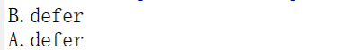

#### 11.2.4.3 GOMAXPROCS

调用 runtime.GOMAXPROCS() 用来设置可以并行计算的 CPU 核数的最大值，并返回之前的值。

示例代码：

```Go
func main() {
    //n := runtime.GOMAXPROCS(1) //打印结果：111111111111111111110000000000000000000011111...
    n := runtime.GOMAXPROCS(2)     //打印结果：010101010101010101011001100101011010010100110...
    fmt.Printf("n = %d\n", n)

    for {
        go fmt.Print(0)
        fmt.Print(1)
    }
}
```

在第一次执行(runtime.GOMAXPROCS(1))时，最多同时只能有一个 goroutine 被执行。所以
会打印很多 1。过了一段时间后，GO 调度器会将其置为休眠，并唤醒另一个 goroutine，这时候就开始打印很多 0 了，在打印的时候，goroutine 是被调度到操作系统线程上的。

在第二次执行(runtime.GOMAXPROCS(2))时，我们使用了两个 CPU，所以两个 goroutine 可以一起被执行，以同样的频率交替打印 0 和 1。

## 11.3 channel

goroutine 运行在相同的地址空间，因此访问共享内存必须做好同步。goroutine 奉行通过通信来共享内存，而不是共享内存来通信。

引⽤类型 channel 是 CSP 模式的具体实现，用于多个 goroutine 通讯。其内部实现了同步，确保并发安全。

### 11.3.1 channel 类型

和 map 类似，channel 也一个对应 make 创建的底层数据结构的引用。

当我们复制一个 channel 或用于函数参数传递时，我们只是拷贝了一个 channel 引用，因此调用者何被调用者将引用同一个 channel 对象。和其它的引用类型一样，channel 的零值也是 nil。

定义一个 channel 时，也需要定义发送到 channel 的值的类型。channel 可以使用内置的 make()函数来创建：
    make(chan Type) //等价于 make(chan Type, 0)
    make(chan Type, capacity)

当 capacity= 0 时，channel 是无缓冲阻塞读写的，当 capacity> 0 时，channel 有缓冲、是非阻塞的，直到写满 capacity 个元素才阻塞写入。

channel 通过操作符<-来接收和发送数据，发送和接收数据语法：
    channel <- value      //发送 value 到 channel
    <-channel             //接收并将其丢弃
    x := <-channel        //从 channel 中接收数据，并赋值给 x
    x, ok := <-channel    //功能同上，同时检查通道是否已关闭或者是否为空

默认情况下，channel 接收和发送数据都是阻塞的，除非另一端已经准备好，这样就使得 goroutine 同步变的更加的简单，而不需要显式的 lock。

示例代码：

```Go
func main() {
    c := make(chan int)

    go func() {
        defer fmt.Println("子协程结束")

        fmt.Println("子协程正在运行……")

        c <- 666 //666发送到c
    }()

    num := <-c //从c中接收数据，并赋值给num

    fmt.Println("num = ", num)
    fmt.Println("main协程结束")
}
```

程序运行结果：

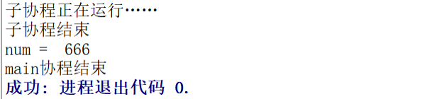

### 11.3.2 无缓冲的 channel

无缓冲的通道（unbuffered channel）是指在接收前没有能力保存任何值的通道。

这种类型的通道要求发送 goroutine 和接收 goroutine 同时准备好，才能完成发送和接收操作。如果两个 goroutine 没有同时准备好，通道会导致先执行发送或接收操作的 goroutine 阻塞等待。

这种对通道进行发送和接收的交互行为本身就是同步的。其中任意一个操作都无法离开另一个操作单独存在。

下图展示两个 goroutine 如何利用无缓冲的通道来共享一个值：

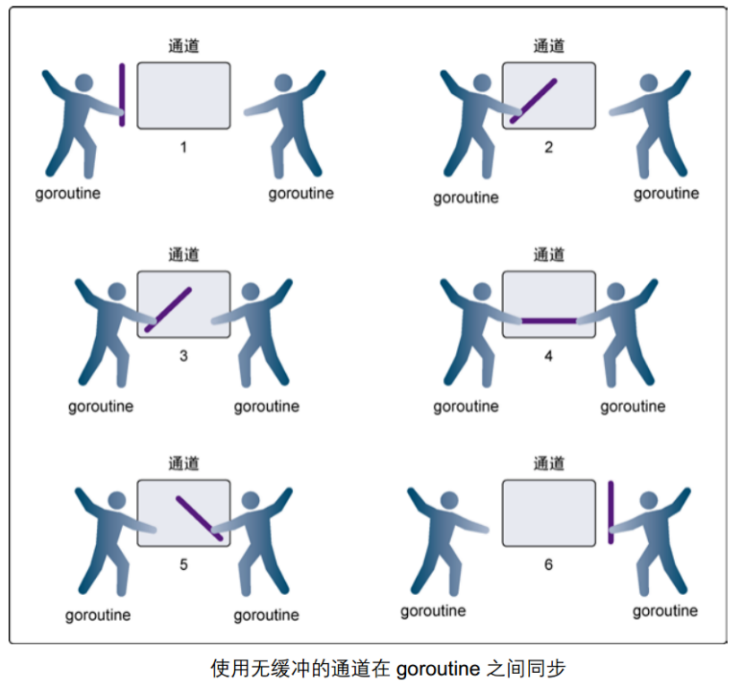

 在第 1 步，两个 goroutine 都到达通道，但哪个都没有开始执行发送或者接收。
 在第 2 步，左侧的 goroutine 将它的手伸进了通道，这模拟了向通道发送数据的行为。这时，这个 goroutine 会在通道中被锁住，直到交换完成。
 在第 3 步，右侧的 goroutine 将它的手放入通道，这模拟了从通道里接收数据。这个 goroutine 一样也会在通道中被锁住，直到交换完成。
 在第 4 步和第 5 步，进行交换，并最终，在第 6 步，两个 goroutine 都将它们的手从通道里拿出来，这模拟了被锁住的 goroutine 得到释放。两个 goroutine 现在都可以去做别的事情了。

无缓冲的 channel 创建格式：
    make(chan Type) //等价于 make(chan Type, 0)

如果没有指定缓冲区容量，那么该通道就是同步的，因此会阻塞到发送者准备好发送和接收者准备好接收。

示例代码：

```Go
func main() {
    c := make(chan int, 0) //无缓冲的通道

    //内置函数 len 返回未被读取的缓冲元素数量， cap 返回缓冲区大小
    fmt.Printf("len(c)=%d, cap(c)=%d\n", len(c), cap(c))

    go func() {
        defer fmt.Println("子协程结束")

        for i := 0; i < 3; i++ {
            c <- i
            fmt.Printf("子协程正在运行[%d]: len(c)=%d, cap(c)=%d\n", i, len(c), cap(c))
        }
    }()

    time.Sleep(2 * time.Second) //延时2s

    for i := 0; i < 3; i++ {
        num := <-c //从c中接收数据，并赋值给num
        fmt.Println("num = ", num)
    }

    fmt.Println("main协程结束")
}
```

程序运行结果：

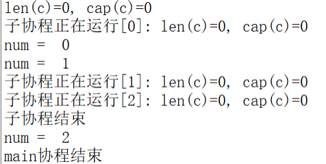

### 11.3.3 有缓冲的 channel

有缓冲的通道（buffered channel）是一种在被接收前能存储一个或者多个值的通道。

这种类型的通道并不强制要求 goroutine 之间必须同时完成发送和接收。通道会阻塞发送和接收动作的条件也会不同。只有在通道中没有要接收的值时，接收动作才会阻塞。只有在通道没有可用缓冲区容纳被发送的值时，发送动作才会阻塞。

这导致有缓冲的通道和无缓冲的通道之间的一个很大的不同：无缓冲的通道保证进行发送和接收的 goroutine 会在同一时间进行数据交换；有缓冲的通道没有这种保证。
示例图如下：

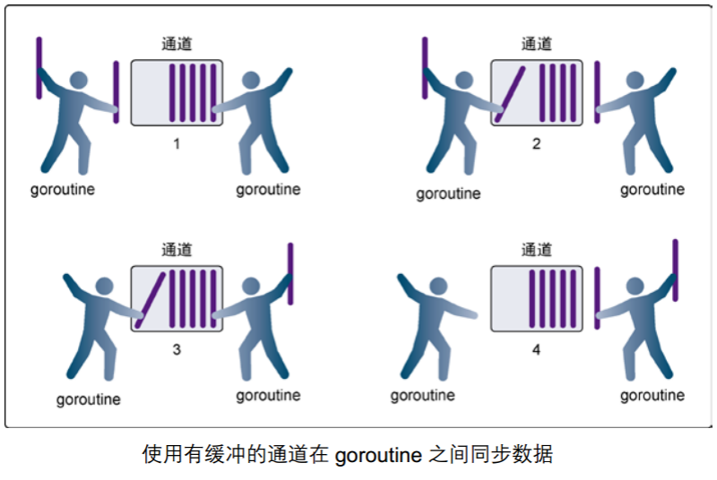

 在第 1 步，右侧的 goroutine 正在从通道接收一个值。
 在第 2 步，右侧的这个 goroutine 独立完成了接收值的动作，而左侧的 goroutine 正在发送一个新值到通道里。
 在第 3 步，左侧的 goroutine 还在向通道发送新值，而右侧的 goroutine 正在从通道接收另外一个值。这个步骤里的两个操作既不是同步的，也不会互相阻塞。
 最后，在第 4 步，所有的发送和接收都完成，而通道里还有几个值，也有一些空间可以存更多的值。

有缓冲的 channel 创建格式：
    make(chan Type, capacity)

如果给定了一个缓冲区容量，通道就是异步的。只要缓冲区有未使用空间用于发送数据，或还包含可以接收的数据，那么其通信就会无阻塞地进行。

示例代码：

```Go
func main() {
    c := make(chan int, 3) //带缓冲的通道

    //内置函数 len 返回未被读取的缓冲元素数量， cap 返回缓冲区大小
    fmt.Printf("len(c)=%d, cap(c)=%d\n", len(c), cap(c))

    go func() {
        defer fmt.Println("子协程结束")

        for i := 0; i < 3; i++ {
            c <- i
            fmt.Printf("子协程正在运行[%d]: len(c)=%d, cap(c)=%d\n", i, len(c), cap(c))
        }
    }()

    time.Sleep(2 * time.Second) //延时2s
    for i := 0; i < 3; i++ {
        num := <-c //从c中接收数据，并赋值给num
        fmt.Println("num = ", num)
    }
    fmt.Println("main协程结束")
}
```

程序运行结果：

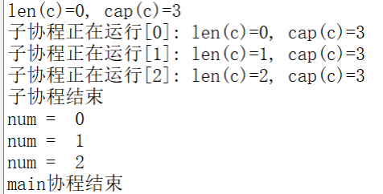

### 11.3.4 range 和 close

如果发送者知道，没有更多的值需要发送到 channel 的话，那么让接收者也能及时知道没有多余的值可接收将是有用的，因为接收者可以停止不必要的接收等待。这可以通过内置的 close 函数来关闭 channel 实现。

示例代码：

```Go
func main() {
    c := make(chan int)

    go func() {
        for i := 0; i < 5; i++ {
            c <- i
        }
        //把 close(c) 注释掉，程序会一直阻塞在 if data, ok := <-c; ok 那一行
        close(c)
    }()

    for {
        //ok为true说明channel没有关闭，为false说明管道已经关闭
        if data, ok := <-c; ok {
            fmt.Println(data)
        } else {
            break
        }
    }

    fmt.Println("Finished")
}
```

程序运行结果：

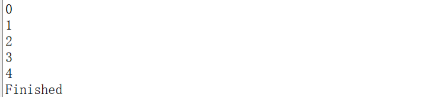

注意点：
channel 不像文件一样需要经常去关闭，只有当你确实没有任何发送数据了，或者你想显式的结束 range 循环之类的，才去关闭 channel；
 关闭 channel 后，无法向 channel 再发送数据(引发 panic 错误后导致接收立即返回零值)；
 关闭 channel 后，可以继续向 channel 接收数据；
 对于 nil channel，无论收发都会被阻塞。

可以使用 range 来迭代不断操作 channel：

```Go
func main() {
    c := make(chan int)

    go func() {
        for i := 0; i < 5; i++ {
            c <- i
        }
        //把 close(c) 注释掉，程序会一直阻塞在 for data := range c 那一行
        close(c)
    }()

    for data := range c {
        fmt.Println(data)
    }
    fmt.Println("Finished")
}
```

### 11.3.5 单方向的 channel

默认情况下，通道是双向的，也就是，既可以往里面发送数据也可以同里面接收数据。

但是，我们经常见一个通道作为参数进行传递而值希望对方是单向使用的，要么只让它发送数据，要么只让它接收数据，这时候我们可以指定通道的方向。

单向 channel 变量的声明非常简单，如下：
var ch1 chan int // ch1 是一个正常的 channel，不是单向的
var ch2 chan<- float64 // ch2 是单向 channel，只用于写 float64 数据
var ch3 <-chan int // ch3 是单向 channel，只用于读取 int 数据

chan<- 表示数据进入管道，要把数据写进管道，对于调用者就是输出。
<-chan 表示数据从管道出来，对于调用者就是得到管道的数据，当然就是输入。

可以将 channel 隐式转换为单向队列，只收或只发，不能将单向 channel 转换为普通 channel：

```Go
    c := make(chan int, 3)
    var send chan<- int = c // send-only
    var recv <-chan int = c // receive-only
    send <- 1
    //<-send //invalid operation: <-send (receive from send-only type chan<- int)
    <-recv
    //recv <- 2 //invalid operation: recv <- 2 (send to receive-only type <-chan int)

    //不能将单向 channel 转换为普通 channel
    d1 := (chan int)(send) //cannot convert send (type chan<- int) to type chan int
    d2 := (chan int)(recv) //cannot convert recv (type <-chan int) to type chan int
```

示例代码：

```Go
//   chan<- //只写
func counter(out chan<- int) {
    defer close(out)
    for i := 0; i < 5; i++ {
        out <- i //如果对方不读 会阻塞
    }
}

//   <-chan //只读
func printer(in <-chan int) {
    for num := range in {
        fmt.Println(num)
    }
}

func main() {
    c := make(chan int) //   chan   //读写

    go counter(c) //生产者
    printer(c)    //消费者

    fmt.Println("done")
}
```

### 11.3.6 定时器

#### 11.3.6.1 Timer

Timer 是一个定时器，代表未来的一个单一事件，你可以告诉 timer 你要等待多长时间，它提供一个 channel，在将来的那个时间那个 channel 提供了一个时间值。

示例代码：

```Go
import "fmt"
import "time"

func main() {
    //创建定时器，2秒后，定时器就会向自己的C字节发送一个time.Time类型的元素值
    timer1 := time.NewTimer(time.Second * 2)
    t1 := time.Now() //当前时间
    fmt.Printf("t1: %v\n", t1)

    t2 := <-timer1.C
    fmt.Printf("t2: %v\n", t2)

    //如果只是想单纯的等待的话，可以使用 time.Sleep 来实现
    timer2 := time.NewTimer(time.Second * 2)
    <-timer2.C
    fmt.Println("2s后")

    time.Sleep(time.Second * 2)
    fmt.Println("再一次2s后")

    <-time.After(time.Second * 2)
    fmt.Println("再再一次2s后")

    timer3 := time.NewTimer(time.Second)
    go func() {
        <-timer3.C
        fmt.Println("Timer 3 expired")
    }()

    stop := timer3.Stop() //停止定时器
    if stop {
        fmt.Println("Timer 3 stopped")
    }

    fmt.Println("before")
    timer4 := time.NewTimer(time.Second * 5) //原来设置3s
    timer4.Reset(time.Second * 1)            //重新设置时间
    <-timer4.C
    fmt.Println("after")
}
```

#### 11.3.6.2 Ticker

Ticker 是一个定时触发的计时器，它会以一个间隔(interval)往 channel 发送一个事件(当前时间)，而 channel 的接收者可以以固定的时间间隔从 channel 中读取事件。

示例代码：

```Go
func main() {
    //创建定时器，每隔1秒后，定时器就会给channel发送一个事件(当前时间)
    ticker := time.NewTicker(time.Second * 1)

    i := 0
    go func() {
        for { //循环
            <-ticker.C
            i++
            fmt.Println("i = ", i)

            if i == 5 {
                ticker.Stop() //停止定时器
            }
        }
    }() //别忘了()

    //死循环，特地不让main goroutine结束
    for {
    }
}
```

## 11.4 select

### 11.4.1 select 作用

Go 里面提供了一个关键字 select，通过 select 可以监听 channel 上的数据流动。

select 的用法与 switch 语言非常类似，由 select 开始一个新的选择块，每个选择条件由 case 语句来描述。

与 switch 语句可以选择任何可使用相等比较的条件相比， select 有比较多的限制，其中最大的一条限制就是每个 case 语句里必须是一个 IO 操作，大致的结构如下：
    select {
    case <-chan1:
        // 如果 chan1 成功读到数据，则进行该 case 处理语句
    case chan2 <- 1:
        // 如果成功向 chan2 写入数据，则进行该 case 处理语句
    default:
        // 如果上面都没有成功，则进入 default 处理流程
    }

在一个 select 语句中，Go 语言会按顺序从头至尾评估每一个发送和接收的语句。

如果其中的任意一语句可以继续执行(即没有被阻塞)，那么就从那些可以执行的语句中任意选择一条来使用。

如果没有任意一条语句可以执行(即所有的通道都被阻塞)，那么有两种可能的情况：
 如果给出了 default 语句，那么就会执行 default 语句，同时程序的执行会从 select 语句后的语句中恢复。
 如果没有 default 语句，那么 select 语句将被阻塞，直到至少有一个通信可以进行下去。

示例代码：

```Go
func fibonacci(c, quit chan int) {
    x, y := 1, 1
    for {
        select {
        case c <- x:
            x, y = y, x+y
        case <-quit:
            fmt.Println("quit")
            return
        }
    }
}

func main() {
    c := make(chan int)
    quit := make(chan int)

    go func() {
        for i := 0; i < 6; i++ {
            fmt.Println(<-c)
        }
        quit <- 0
    }()

    fibonacci(c, quit)
}
```

运行结果如下：

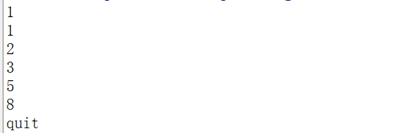

### 11.4.2 超时

有时候会出现 goroutine 阻塞的情况，那么我们如何避免整个程序进入阻塞的情况呢？我们可以利用 select 来设置超时，通过如下的方式实现：

```Go
func main() {
    c := make(chan int)
    o := make(chan bool)
    go func() {
        for {
            select {
            case v := <-c:
                fmt.Println(v)
            case <-time.After(5 * time.Second):
                fmt.Println("timeout")
                o <- true
                break
            }
        }
    }()
    //c <- 666 // 注释掉，引发 timeout
    <-o
}
```
