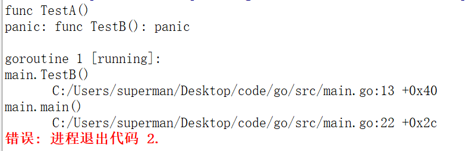
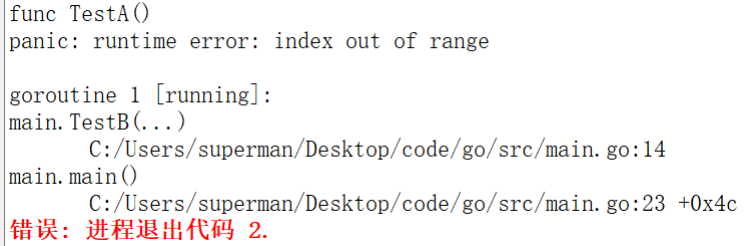

# 9. 异常处理

## 9.1 error 接口

Go 语言引入了一个关于错误处理的标准模式，即 error 接口，它是 Go 语言内建的接口类型，该接口的定义如下：

```Go
type error interface {
    Error() string
}
```

Go 语言的标准库代码包 errors 为用户提供如下方法：

```Go
package errors

type errorString struct {
    text string
}

func New(text string) error {
    return &errorString{text}
}

func (e *errorString) Error() string {
    return e.text
}
```

另一个可以生成 error 类型值的方法是调用 fmt 包中的 Errorf 函数：

```Go
package fmt
import "errors"

func Errorf(format string, args ...interface{}) error {
    return errors.New(Sprintf(format, args...))
}
```

示例代码：

```Go
import (
    "errors"
    "fmt"
)

func main() {
    var err1 error = errors.New("a normal err1")
    fmt.Println(err1) //a normal err1

    var err2 error = fmt.Errorf("%s", "a normal err2")
    fmt.Println(err2) //a normal err2
}
```

函数通常在最后的返回值中返回错误信息：

```Go
import (
    "errors"
    "fmt"
)

func Divide(a, b float64) (result float64, err error) {
    if b == 0 {
        result = 0.0
        err = errors.New("runtime error: divide by zero")
        return
    }

    result = a / b
    err = nil
    return
}

func main() {
    r, err := Divide(10.0, 0)
    if err != nil {
        fmt.Println(err) //错误处理 runtime error: divide by zero
    } else {
        fmt.Println(r) // 使用返回值
    }
}
```

## 9.2 panic

在通常情况下，向程序使用方报告错误状态的方式可以是返回一个额外的 error 类型值。

但是，当遇到不可恢复的错误状态的时候，如数组访问越界、空指针引用等，这些运行时错误会引起 painc 异常。这时，上述错误处理方式显然就不适合了。反过来讲，在一般情况下，我们不应通过调用 panic 函数来报告普通的错误，而应该只把它作为报告致命错误的一种方式。当某些不应该发生的场景发生时，我们就应该调用 panic。

一般而言，当 panic 异常发生时，程序会中断运行，并立即执行在该 goroutine（可以先理解成线程，在中被延迟的函数（defer 机制）。随后，程序崩溃并输出日志信息。日志信息包括 panic value 和函数调用的堆栈跟踪信息。

不是所有的 panic 异常都来自运行时，直接调用内置的 panic 函数也会引发 panic 异常；panic 函数接受任何值作为参数。
func panic(v interface{})

调用 panic 函数引发的 panic 异常：

```Go
func TestA() {
    fmt.Println("func TestA()")
}

func TestB() {
    panic("func TestB(): panic")
}

func TestC() {
    fmt.Println("func TestC()")
}

func main() {
    TestA()
    TestB()//TestB()发生异常，中断程序
    TestC()
}
```

运行结果：



内置的 panic 函数引发的 panic 异常：

```Go
func TestA() {
    fmt.Println("func TestA()")
}

func TestB(x int) {
    var a [10]int
    a[x] = 222 //x值为11时，数组越界
}

func TestC() {
    fmt.Println("func TestC()")
}

func main() {
    TestA()
    TestB(11)//TestB()发生异常，中断程序
    TestC()
}
```

运行结果：



## 9.3 recover

运行时 panic 异常一旦被引发就会导致程序崩溃。这当然不是我们愿意看到的，因为谁也不能保证程序不会发生任何运行时错误。

不过，Go 语言为我们提供了专用于“拦截”运行时 panic 的内建函数——recover。它可以是当前的程序从运行时 panic 的状态中恢复并重新获得流程控制权。
func recover() interface{}

注意：recover 只有在 defer 调用的函数中有效。

如果调用了内置函数 recover，并且定义该 defer 语句的函数发生了 panic 异常，recover 会使程序从 panic 中恢复，并返回 panic value。导致 panic 异常的函数不会继续运行，但能正常返回。在未发生 panic 时调用 recover，recover 会返回 nil。

示例代码：

```Go
func TestA() {
    fmt.Println("func TestA()")
}

func TestB() (err error) {
    defer func() { //在发生异常时，设置恢复
        if x := recover(); x != nil {
            //panic value被附加到错误信息中；
	      //并用err变量接收错误信息，返回给调用者。
            err = fmt.Errorf("internal error: %v", x)
        }
    }()

    panic("func TestB(): panic")
}

func TestC() {
    fmt.Println("func TestC()")
}

func main() {
    TestA()
    err := TestB()
    fmt.Println(err)
    TestC()

    /*
        运行结果：
        func TestA()
        internal error: func TestB(): panic
        func TestC()
    */
}
```

延迟调用中引发的错误，可被后续延迟调用捕获，但仅最后⼀个错误可被捕获：

```Go
func test() {
    defer func() {
        fmt.Println(recover())
    }()

    defer func() {
        panic("defer panic")
    }()

    panic("test panic")
}

func main() {
    test()
    //运行结果：defer panic
}
```
